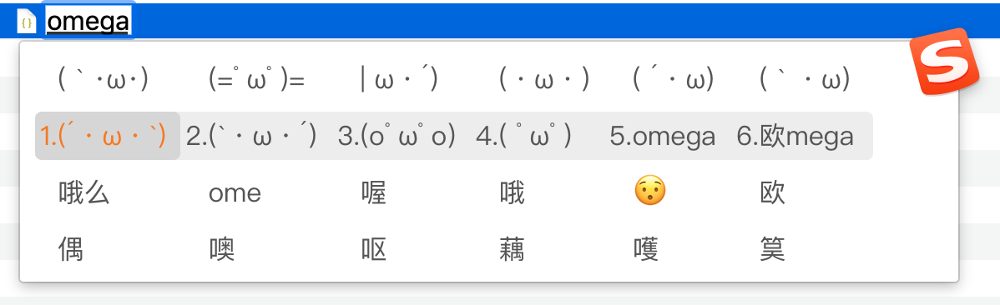
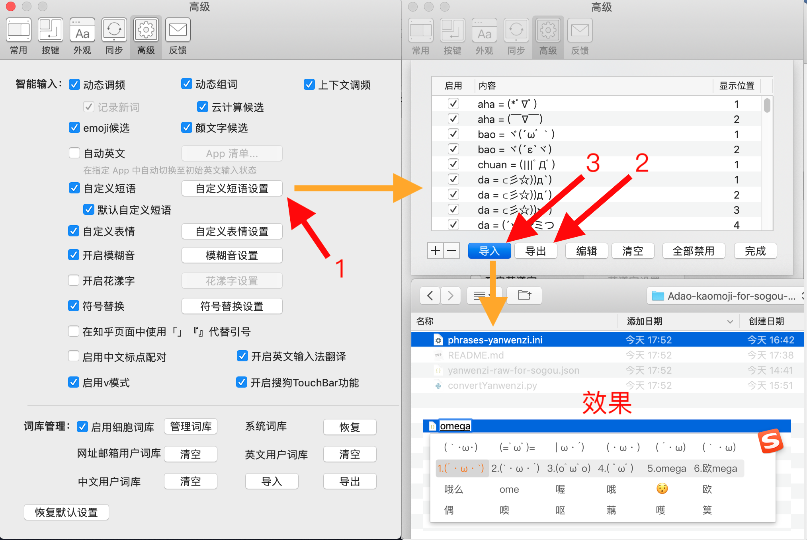

# Adao-kaomoji-for-sogou-pinyin-input-method

1~3 步即可使用：\[略改 JSON 配置→]\[一键生成搜狗  `phrases.ini`→]在搜狗设置导入→开始像施放技能般输出颜文字 (＾o＾)ﾉ



本项目旨在

1. 提供使用电脑版搜狗拼音输入法快速输入 A 岛颜文字的方法；
2. 探索以颜文字为代表的快捷消息的管理方式、在各处的输入方法。

为此，我没有直接编辑搜狗拼音的自定义短语配置文件 `phrases.ini`，而是尝试在更结构化的数据（JSON）里，给 A 岛的 87 个颜文字命名（按我个人理解）、设置快捷短语（按我个人口味）：

```json
……
		["(つд⊂)","wulian",1,"捂脸;玩鸟"],
        ["(ﾟДﾟ≡ﾟДﾟ)","wtf",2,"左右摇头惊恐"],
        ["(＾o＾)ﾉ","hi",1,"^眼圆嘴右打招呼"],
……
        ["ヾ(´ωﾟ｀)","bao",1,"不明眼猫嘴左抱抱"],
        ["(*´ω`*)","gg",1,"好想要哥哥们的小○○"],
        ["(・ω・)","omega",4,"猫嘴点点眼前看"],
        ["( ´・ω)","omega",5,"点点眼八字耳猫嘴右侧"],
        ["(｀・ω)","omega",6,"点点眼反八字耳猫嘴右侧"],
……
```

然后写了一个转换工具把它转换成 `phrases.ini` 的格式。我认为这有助于从目标 1 跨越到目标 2。

## 配置步骤

1. 生成自定义短语配置文件（也可以直接使用我提供的 `phrases-yanwenzi-导入搜狗前另存成UTF-16 LE编码.ini`）：
   1. （可选）编辑 `yanwenzi-raw-for-sogou.json`，以配置短语、在选词时的出现位置等；
   2. 把 `yanwenzi-raw-for-sogou.json` 文件放到当前 shell 工作目录；执行 `python3 convertYanwenzi.py`
2. 在搜狗拼音的设置中，将现有的自定义短语导出，作为**备份**；清空现有的自定义短语；导入刚才生成的 `phrases-yanwenzi.ini`
   1. 如果不清空直接导入，搜狗拼音会把新旧自定义短语合并起来……详细规则我未考察。


Mac 版的配置位置和效果图：



## TODO

+ 多输出目标
  + 微软拼音？
  + Rime
  + 成为颜文字界的 pandoc？
+ 一个颜文字对应多个自定义短语？
+ 描述文字拆成 tags（像 https://gelbooru.com ）、颜文字标准化 ( ﾟ∀。)？

## 相关工作

+ JaHIY/yanwenzi.json A岛颜文字
    + 我从这里的 `yanwenzi.json` 出发做的修改。
    + https://gist.github.com/JaHIY/31b086b6b4326e86d15e
+ Adao-emoji-for-Google-Pinyin-Input
    + 生成可导入Google拼音输入法的A岛颜文字字典
    + https://github.com/WatcherOfTheWorld/Adao-emoji-for-Google-Pinyin-Input
+ iBus-Anthy顔文字
    + Mort's collection of everyday use kaomojis
    + https://github.com/soimort/anthy-kaomoji

More：

+ [颜文字 搜狗 site:adnmb1.com](https://www.google.com/search?&q=%E9%A2%9C%E6%96%87%E5%AD%97+%E6%90%9C%E7%8B%97+site:adnmb1.com&ie=UTF-8&oe=UTF-8)
    + ad 前缀思路好！如 http://adnmb1.com/t/13882162 和 http://adnmb1.com/t/13572077
+ [颜文字 输入法 site:adnmb1.com](https://www.google.com/search?&q=%E9%A2%9C%E6%96%87%E5%AD%97+%E8%BE%93%E5%85%A5%E6%B3%95+site:adnmb1.com&ie=UTF-8&oe=UTF-8)

